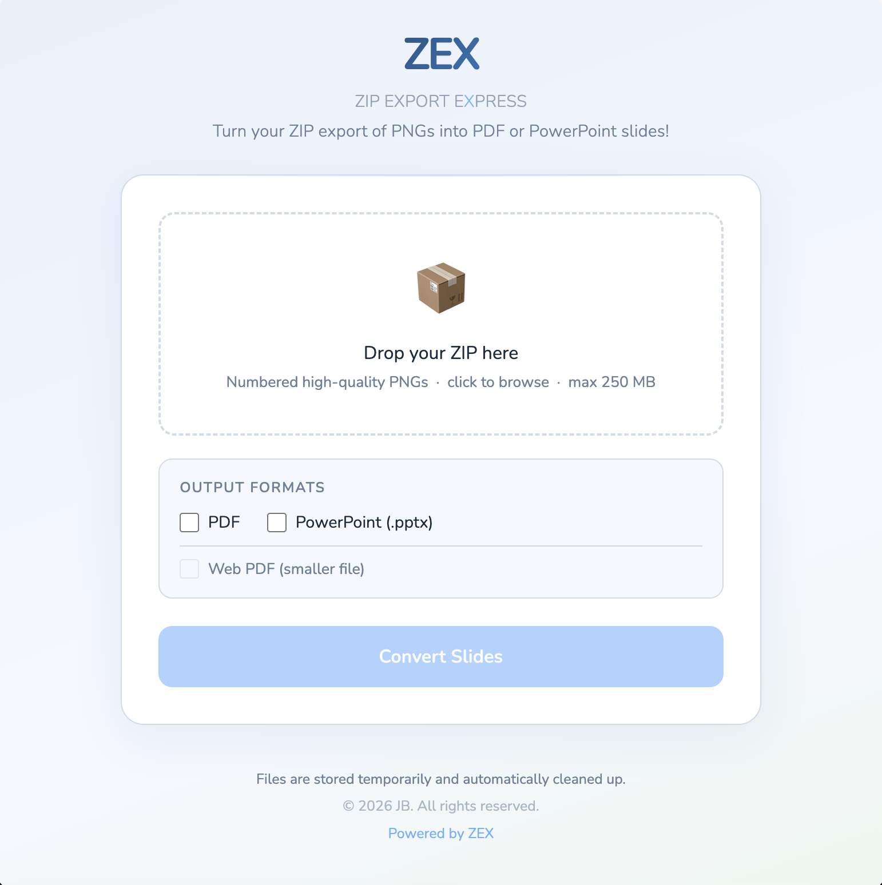
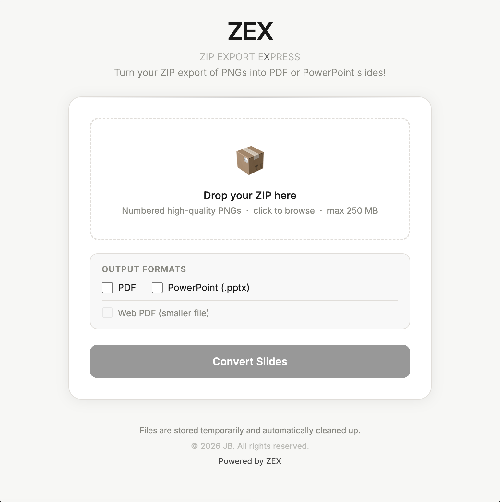
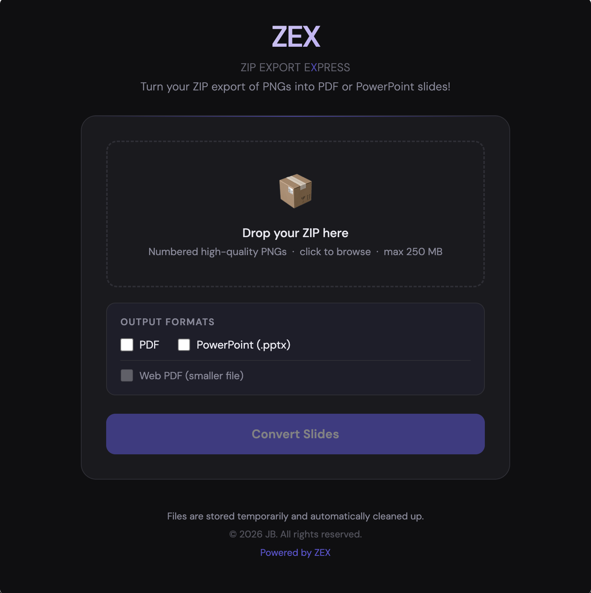

# ZEX — Zip Export EXpress

Convert a ZIP of Canva slide exports (numbered high-quality PNGs) into downloadable **PDF** and/or **PowerPoint (PPTX)** — in the browser, from a single PHP file on shared hosting.

No Node.js. Composer is optional for higher-quality PDFs and library-based PPTX output; the app runs with PHP’s built-in **zip** and **gd** extensions alone.

## What it does

Canva can export a deck as individual PNGs in a ZIP, numbered in order (`1.PNG`, `2.PNG`, …). ZEX extracts those images, sorts them naturally, and builds the outputs you choose. Files are named after your uploaded ZIP; a progress bar shows upload status. Session data under `tmp/` is removed automatically after a short TTL.

## Features

- **Single PHP entrypoint** — deploy `index.php` and a writable `tmp/` directory
- **Selectable outputs** — check **PDF** and/or **PowerPoint (.pptx)**; at least one required per run
- **Web PDF** — optional “smaller file” PDF: slides re-encoded as JPEG using configurable quality (`PDF_WEB_JPEG_QUALITY`, default 90). Full-quality PDFs keep PNG (TCPDF path) or higher JPEG quality on the native GD path
- **ZIP upload** — drag-and-drop or file picker; client-side validation and server-side `MAX_MB` cap (default **250 MB**)
- **Natural sort** — `10.PNG` sorts after `9.PNG`, not after `1.PNG`
- **macOS noise skipped** — `._*` and `__MACOSX` entries ignored
- **Recursive PNG discovery** — PNGs anywhere inside the ZIP are collected
- **Three UI themes** — `light-breezy`, `business-clean`, `dark-moody` via one config constant
- **Footer branding** — `COPYRIGHT_HOLDER` for the rights line; “Powered by ZEX” links to this repo
- **Automatic cleanup** — session folders under `tmp/` older than **5 minutes** are deleted on each HTTP request
- **No database, no accounts**

## PDF generation (automatic backend choice)

Order of preference:

1. **TCPDF** (if `vendor/autoload.php` exists and TCPDF is installed) — lossless PNG pages by default; web mode embeds JPEG from PNGs at `PDF_WEB_JPEG_QUALITY`
2. **Native GD** — builds a minimal PDF with JPEG image streams (quality `PDF_JPEG_QUALITY_HIGH` or `PDF_WEB_JPEG_QUALITY`)
3. **Imagick** (if no Composer autoload but the `imagick` extension is loaded) — multipage PDF; web mode uses JPEG compression settings

## PPTX generation

1. **phpoffice/phppresentation** when present via Composer
2. Otherwise a **manual Open XML** packager (valid PPTX without that dependency)

## Requirements

- PHP 7.4+ (PHP 8.x recommended)
- Extensions: **zip**, **gd** — typical on shared hosts
- Writable **`tmp/`** (same path as `UPLOAD_DIR` / `OUTPUT_DIR` in `index.php`)

Optional:

- **imagick** — alternative PDF engine when Composer is not used
- **Composer packages** — `tecnickcom/tcpdf`, `phpoffice/phppresentation` for the preferred PDF/PPTX paths

Check extensions:

```bash
php -m | grep -E "zip|gd"
```

## Installation

```bash
git clone https://github.com/josephbu/zex.git
cd zex
mkdir tmp && chmod 775 tmp
```

Upload `index.php` and the `tmp/` folder (or let the host create it with correct permissions). Visit the site URL in a browser.

**Optional — Composer** (recommended if you want TCPDF + PhpPresentation):

```bash
composer require tecnickcom/tcpdf phpoffice/phppresentation
```

No config change is required for ZEX to detect `vendor/autoload.php`.

## Configuration

All tunables are at the top of `index.php`:

```php
define('UPLOAD_DIR',           __DIR__ . '/tmp/');
define('OUTPUT_DIR',           __DIR__ . '/tmp/');
define('MAX_MB',               250);
define('PDF_WEB_JPEG_QUALITY', 90);   // 1–100, web-optimized PDF only
define('PDF_JPEG_QUALITY_HIGH',  95);   // native GD path, non–web PDF
define('SLIDE_W_PX',  1920);
define('SLIDE_H_PX',  1080);
define('PPTX_W_EMU',  9144000);  // 16:9 widescreen (10″ × 5.625″)
define('PPTX_H_EMU',  5143500);
define('UI_THEME',    'light-breezy'); // or business-clean | dark-moody
define('COPYRIGHT_HOLDER', 'JB');       // footer “All rights reserved” name
```

**Session TTL:** `cleanup_old_sessions()` defaults to **300** seconds (5 minutes). To change it, edit the default argument in that function in `index.php`.

### Themes

| Value | Description |
| --- | --- |
| `light-breezy` | Soft blue-white gradient, sky blue accent, Playfair Display heading |
| `business-clean` | Off-white, near-black accent, Fraunces heading |
| `dark-moody` | Dark surface, purple/violet accent, Instrument Serif heading |

#### Theme screenshots

**light-breezy**



**business-clean**



**dark-moody**



### Slide size (PPTX)

Defaults match a 1920×1080-style 16:9 canvas. Adjust `PPTX_W_EMU` / `PPTX_H_EMU` if your exports use another aspect ratio (1 EMU = 1/914400 inch).

Example for a square slide:

```php
define('PPTX_W_EMU', 6858000);
define('PPTX_H_EMU', 6858000);
```

## Upload size limits

`MAX_MB` is enforced in PHP, but **`upload_max_filesize`** and **`post_max_size`** must be at least as large on the server. Example for a 250 MB upload:

```apache
php_value upload_max_filesize 260M
php_value post_max_size       260M
php_value memory_limit        512M
```

Large decks load each PNG into memory when building outputs; leave headroom in `memory_limit`.

## Directory layout

```
zex/
├── index.php
├── LICENSE
├── README.md
├── tmp/              # session extraction + outputs (gitignored / not in repo by default)
└── vendor/           # optional, from Composer
```

## How it works (short)

1. Browser POSTs the ZIP with selected `out_pdf` / `out_pptx` and optional `pdf_web`.
2. PHP extracts to `tmp/<sessionId>/`, collects PNGs, natural-sorts, skips junk files.
3. PDF and/or PPTX are written into that folder; JSON returns download paths and display names.
4. `?action=download` streams a generated file with safe path validation.
5. Each request runs cleanup: remove session directories older than the configured age.

## License

ZEX is licensed under the **[GNU Affero General Public License v3.0](https://www.gnu.org/licenses/agpl-3.0.html)**. See the [`LICENSE`](LICENSE) file in this repository for the full text.

The AGPL is a strong copyleft license. In particular, if you run a **modified** version of ZEX as a **network service** that users interact with, you are generally required to offer those users access to the **corresponding source code** of the version they are using. Read the license and, if needed, consult your own counsel; this README is not legal advice.
